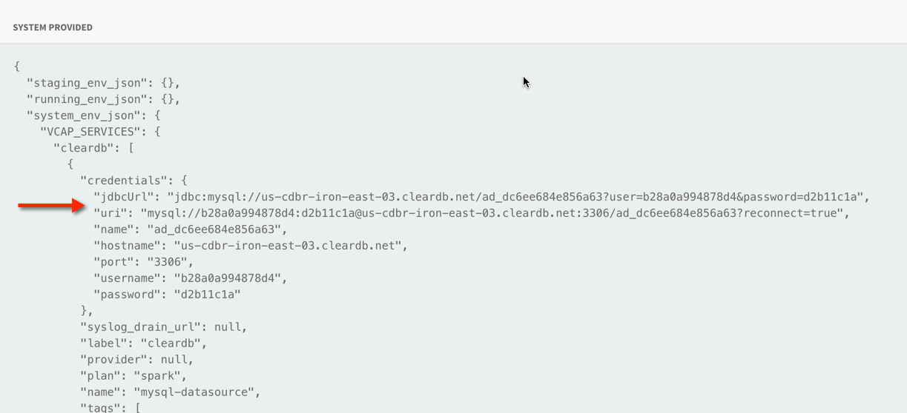
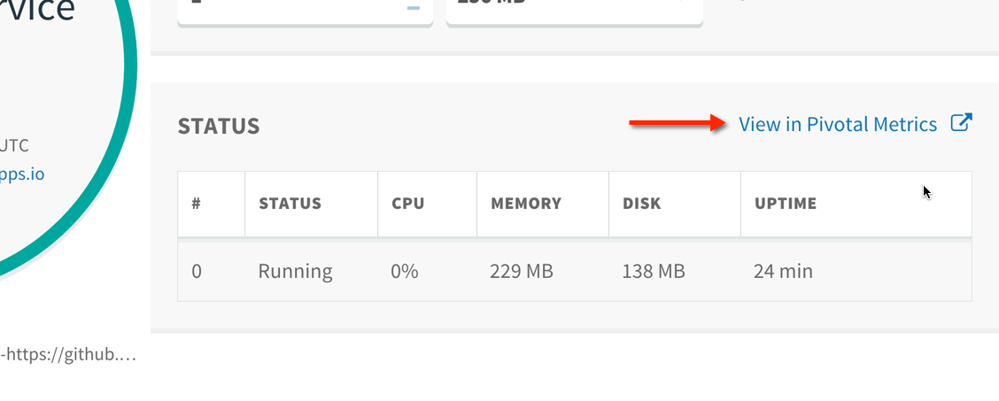
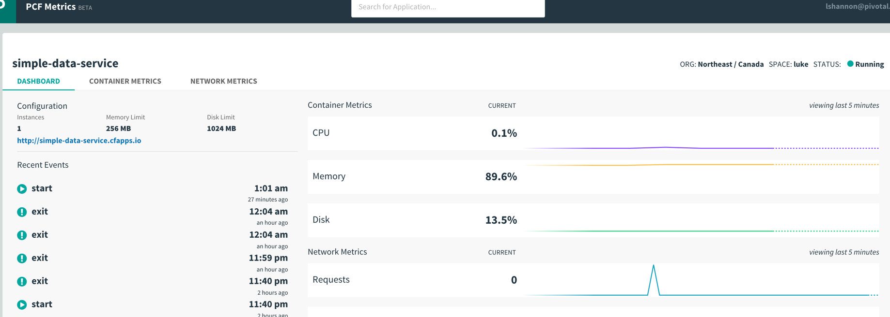
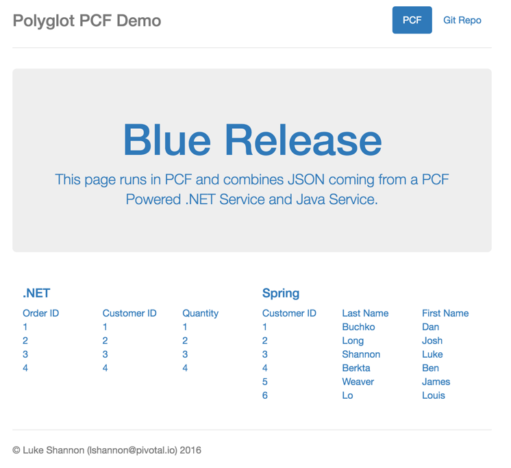
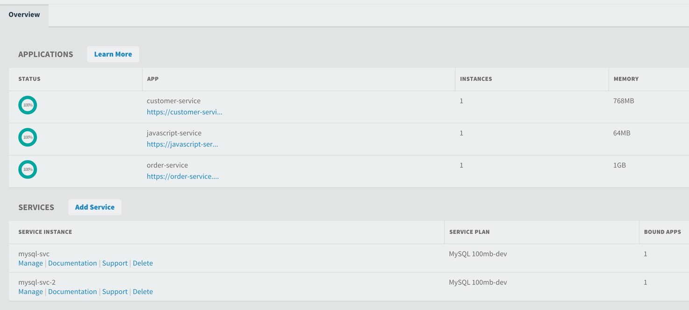
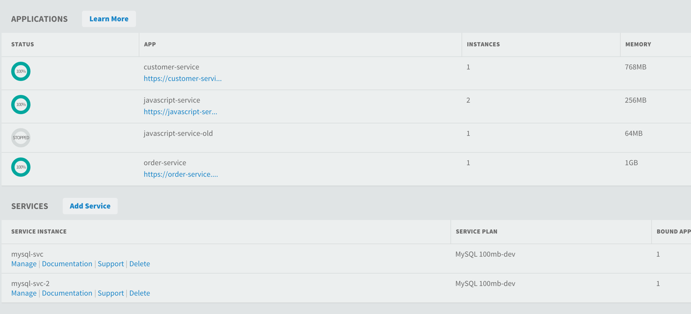
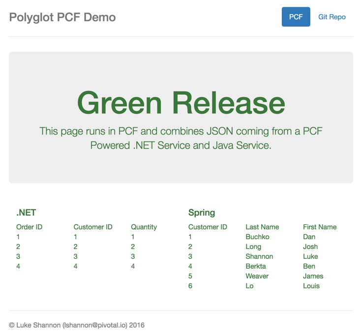

# DevOps Days Vancouver Demos

Pivotal Cloud Foundry (PCF) is a platform that runs on top of an IAAS layer that simplifies developer and operator workflows enabling a true DevOps culture to emerge.

To demonstrate this we will review:

- Simple Spring Boot Service Using Spring JDBC to work with a data base (exposing data via REST)
- A Polyglot application stack running in PCF (.NET, Java, Javascript)
- A Blue/Green update to a running service without affecting availablity
- Push button scaling of applications using PCF
- Access to Logs and metrics using PCF
- Integration with 3rd party log monitoring tools

## Simple Application with Data Service Demo

A demo that shows pushing a Simple Spring Boot application that uses Spring JDBC Template to work with a database bound to the application by the platform.

This demo is designed to run on PWS:

http://run.pivotal.io

### Authentication

To authenticate to the platform, run './demo_simple_service_1_authenticate.sh' 

```shell

devops-days git:(master) ✗ ./demo_simple_service_1_authenticate.sh 
 _______    ______   ________        _______                                    
/       \  /      \ /        |      /       \                                   
$$$$$$$  |/$$$$$$  |$$$$$$$$/       $$$$$$$  |  ______   _____  ____    ______  
$$ |__$$ |$$ |  $$/ $$ |__          $$ |  $$ | /      \ /     \/    \  /      \ 
$$    $$/ $$ |      $$    |         $$ |  $$ |/$$$$$$  |$$$$$$ $$$$  |/$$$$$$  |
$$$$$$$/  $$ |   __ $$$$$/          $$ |  $$ |$$    $$ |$$ | $$ | $$ |$$ |  $$ |
$$ |      $$ \__/  |$$ |            $$ |__$$ |$$$$$$$$/ $$ | $$ | $$ |$$ \__$$ |
$$ |      $$    $$/ $$ |            $$    $$/ $$       |$$ | $$ | $$ |$$    $$/ 
$$/        $$$$$$/  $$/             $$$$$$$/   $$$$$$$/ $$/  $$/  $$/  $$$$$$/  
                                                                                
 
Running: https://api.run.pivotal.io
This is running in an public AWS cloud
 
cf api api.run.pivotal.io
Setting api endpoint to api.run.pivotal.io...
OK

                   
API endpoint:   https://api.run.pivotal.io (API version: 2.53.0)   
Not logged in. Use 'cf login' to log in.
cf login -a https://api.run.pivotal.io
API endpoint: https://api.run.pivotal.io

Email> <enter the email your account was set up with>

Password> 
Authenticating...
OK

                   
API endpoint:   https://api.run.pivotal.io (API version: 2.53.0)   
User:           lshannon@pivotal.io   
Org:            Northeast / Canada   
Space:          luke   
➜  devops-days git:(master) ✗                                        


```

### Authenication Notes

Note the organization and space were specified for this demo.

For more on PCF Organizations and Spaces:

https://docs.cloudfoundry.org/concepts/roles.html

### Deployment

To deploy the sample run ./demo_simple_service_2_deploy.sh

```shell

devops-days git:(master) ✗ ./demo_simple_service_2_deploy.sh
 _______    ______   ________        _______                                    
/       \  /      \ /        |      /       \                                   
$$$$$$$  |/$$$$$$  |$$$$$$$$/       $$$$$$$  |  ______   _____  ____    ______  
$$ |__$$ |$$ |  $$/ $$ |__          $$ |  $$ | /      \ /     \/    \  /      \ 
$$    $$/ $$ |      $$    |         $$ |  $$ |/$$$$$$  |$$$$$$ $$$$  |/$$$$$$  |
$$$$$$$/  $$ |   __ $$$$$/          $$ |  $$ |$$    $$ |$$ | $$ | $$ |$$ |  $$ |
$$ |      $$ \__/  |$$ |            $$ |__$$ |$$$$$$$$/ $$ | $$ | $$ |$$ \__$$ |
$$ |      $$    $$/ $$ |            $$    $$/ $$       |$$ | $$ | $$ |$$    $$/ 
$$/        $$$$$$/  $$/             $$$$$$$/   $$$$$$$/ $$/  $$/  $$/  $$$$$$/  
                                                                                
 
Running: https://api.run.pivotal.io
This is running in an public AWS cloud
 
Pushing Application Using manifest.yml:
 
applications:
- name: simple-data-service
memory: 256M
path: target/simple-data-pcf-application-0.0.1-SNAPSHOT.jar
host: simple-data-service
services:
- mysql-datasource
 
Using manifest file /Users/lshannon/Documents/devops-days/Simple-Data-Application/manifest.yml

Creating app simple-data-service in org Northeast / Canada / space luke as lshannon@pivotal.io...
OK

Using route simple-data-service.cfapps.io
Binding simple-data-service.cfapps.io to simple-data-service...
OK

Uploading simple-data-service...
Uploading app files from: /Users/lshannon/Documents/devops-days/Simple-Data-Application/target/simple-data-pcf-application-0.0.1-SNAPSHOT.jar
Uploading 546.1K, 99 files
Done uploading               
OK
Binding service mysql-datasource to app simple-data-service in org Northeast / Canada / space luke as lshannon@pivotal.io...
OK

Starting app simple-data-service in org Northeast / Canada / space luke as lshannon@pivotal.io...
Downloading binary_buildpack...
Downloading nodejs_buildpack...
Downloading python_buildpack...
Downloading go_buildpack...
Downloading php_buildpack...
Downloading java_buildpack...
Downloading staticfile_buildpack...
Downloading ruby_buildpack...
Downloading liberty_buildpack...
Downloaded nodejs_buildpack
Downloaded java_buildpack
Downloaded python_buildpack
Downloaded ruby_buildpack
Downloaded staticfile_buildpack
Downloaded go_buildpack
Downloaded php_buildpack
Downloaded liberty_buildpack
Downloaded binary_buildpack
Creating container
Successfully created container
Downloading app package...
Downloaded app package (13.7M)
Staging...
-----> Java Buildpack Version: v3.6 (offline) | https://github.com/cloudfoundry/java-buildpack.git#5194155
-----> Downloading Open Jdk JRE 1.8.0_71 from https://download.run.pivotal.io/openjdk/trusty/x86_64/openjdk-1.8.0_71.tar.gz (found in cache)
       Expanding Open Jdk JRE to .java-buildpack/open_jdk_jre (1.0s)
-----> Downloading Open JDK Like Memory Calculator 2.0.1_RELEASE from https://download.run.pivotal.io/memory-calculator/trusty/x86_64/memory-calculator-2.0.1_RELEASE.tar.gz (found in cache)
       Memory Settings: -Xss853K -Xmx160M -XX:MetaspaceSize=64M -Xms160M -XX:MaxMetaspaceSize=64M
-----> Downloading Spring Auto Reconfiguration 1.10.0_RELEASE from https://download.run.pivotal.io/auto-reconfiguration/auto-reconfiguration-1.10.0_RELEASE.jar (found in cache)
Exit status 0
Staging complete
Uploading droplet, build artifacts cache...
Uploading build artifacts cache...
Uploading droplet...
Uploaded build artifacts cache (108B)
Uploaded droplet (58.6M)
Uploading complete

0 of 1 instances running, 1 starting
0 of 1 instances running, 1 starting
1 of 1 instances running

App started


OK

App simple-data-service was started using this command `CALCULATED_MEMORY=$($PWD/.java-buildpack/open_jdk_jre/bin/java-buildpack-memory-calculator-2.0.1_RELEASE -memorySizes=metaspace:64m.. -memoryWeights=heap:75,metaspace:10,native:10,stack:5 -memoryInitials=heap:100%,metaspace:100% -totMemory=$MEMORY_LIMIT) && JAVA_OPTS="-Djava.io.tmpdir=$TMPDIR -XX:OnOutOfMemoryError=$PWD/.java-buildpack/open_jdk_jre/bin/killjava.sh $CALCULATED_MEMORY" && SERVER_PORT=$PORT eval exec $PWD/.java-buildpack/open_jdk_jre/bin/java $JAVA_OPTS -cp $PWD/.:$PWD/.java-buildpack/spring_auto_reconfiguration/spring_auto_reconfiguration-1.10.0_RELEASE.jar org.springframework.boot.loader.JarLauncher`

Showing health and status for app simple-data-service in org Northeast / Canada / space luke as lshannon@pivotal.io...
OK

requested state: started
instances: 1/1
usage: 256M x 1 instances
urls: simple-data-service.cfapps.io
last uploaded: Sat Apr 16 20:34:37 UTC 2016
stack: cflinuxfs2
buildpack: java-buildpack=v3.6-offline-https://github.com/cloudfoundry/java-buildpack.git#5194155 java-main open-jdk-like-jre=1.8.0_71 open-jdk-like-memory-calculator=2.0.1_RELEASE spring-auto-reconfiguration=1.10.0_RELEASE

     state     since                    cpu    memory      disk      details   
#0   running   2016-04-16 01:35:15 PM   0.0%   0 of 256M   0 of 1G      
➜  devops-days git:(master) ✗ 


```

The deployed service will be displayed in the Application Console of PWS.


### Deployment Notes

Note that the application was push to PCF with the JDBC credentials for a local 'Development' connection configured in the application.properties. However the platform injected the credentials of the service running in the space of the platform that was specified in the manifest.yml file rather than using the 'Development' credentials.

application.properties
```shell
spring.datasource.url=jdbc:mysql://localhost:3306/messages
spring.datasource.username=root
spring.datasource.password=
spring.datasource.driver-class-name=com.mysql.jdbc.Driver
insert.message=INSERT INTO message (message) VALUES (?)
delete.message=DELETE from message where id = ?
select.message=SELECT * FROM message
schema.message=CREATE TABLE IF NOT exists message (id int(11) NOT NULL AUTO_INCREMENT, message varchar(45) DEFAULT NULL, PRIMARY KEY (`id`)) ENGINE=InnoDB AUTO_INCREMENT=4 DEFAULT CHARSET=utf8;
db.message=CREATE DATABASE IF NOT EXISTS messages
```

VCAP service containing the credentials of the Database bound to the space the application is running in. These are injected into the application at runtime



### Log Monitoring with Paper Trails

Create an account on Papertrail:

https://papertrailapp.com/

Follow the directions for setting CloudFoundry on Papertrail:

http://help.papertrailapp.com/kb/hosting-services/cloud-foundry/

Run ./demo_simple_service_3_log.sh to set up the custom service up to drain the logs to Papertrail and bind the custom service to the application.

```shell

➜  devops-days git:(master) ✗ ./demo_simple_service_3_log.sh 
Creating user provided service my-logs in org Northeast / Canada / space luke as lshannon@pivotal.io...
OK
Binding service my-logs to app simple-data-service in org Northeast / Canada / space luke as lshannon@pivotal.io...
OK
TIP: Use 'cf restage simple-data-service' to ensure your env variable changes take effect
Stopping app simple-data-service in org Northeast / Canada / space luke as lshannon@pivotal.io...
OK

Starting app simple-data-service in org Northeast / Canada / space luke as lshannon@pivotal.io...

0 of 1 instances running, 1 starting
0 of 1 instances running, 1 starting
1 of 1 instances running

App started


OK

App simple-data-service was started using this command `CALCULATED_MEMORY=$($PWD/.java-buildpack/open_jdk_jre/bin/java-buildpack-memory-calculator-2.0.1_RELEASE -memorySizes=metaspace:64m.. -memoryWeights=heap:75,metaspace:10,native:10,stack:5 -memoryInitials=heap:100%,metaspace:100% -totMemory=$MEMORY_LIMIT) && JAVA_OPTS="-Djava.io.tmpdir=$TMPDIR -XX:OnOutOfMemoryError=$PWD/.java-buildpack/open_jdk_jre/bin/killjava.sh $CALCULATED_MEMORY" && SERVER_PORT=$PORT eval exec $PWD/.java-buildpack/open_jdk_jre/bin/java $JAVA_OPTS -cp $PWD/.:$PWD/.java-buildpack/spring_auto_reconfiguration/spring_auto_reconfiguration-1.10.0_RELEASE.jar org.springframework.boot.loader.JarLauncher`

Showing health and status for app simple-data-service in org Northeast / Canada / space luke as lshannon@pivotal.io...
OK

requested state: started
instances: 1/1
usage: 256M x 1 instances
urls: simple-data-service.cfapps.io
last uploaded: Sun Apr 17 06:40:05 UTC 2016
stack: cflinuxfs2
buildpack: java-buildpack=v3.6-offline-https://github.com/cloudfoundry/java-buildpack.git#5194155 java-main open-jdk-like-jre=1.8.0_71 open-jdk-like-memory-calculator=2.0.1_RELEASE spring-auto-reconfiguration=1.10.0_RELEASE

     state     since                    cpu    memory           disk           details   
#0   running   2016-04-17 01:01:45 AM   0.1%   246.1M of 256M   138.3M of 1G      
➜  devops-days git:(master) ✗ 

```
After a short pause the logs will show up in the Papertrail dashboard.


### Using Metrics Dashboard

Click the link App Console for the application.



This will open a link in a seperate window to the Metrics Dashboard.



### Clean Up

To remove the deployed application run ./demo_simple_service_4_reset.sh

```shell

devops-days git:(master) ✗ ./demo_simple_service_4_reset.sh 
 _______    ______   ________        _______                                    
/       \  /      \ /        |      /       \                                   
$$$$$$$  |/$$$$$$  |$$$$$$$$/       $$$$$$$  |  ______   _____  ____    ______  
$$ |__$$ |$$ |  $$/ $$ |__          $$ |  $$ | /      \ /     \/    \  /      \ 
$$    $$/ $$ |      $$    |         $$ |  $$ |/$$$$$$  |$$$$$$ $$$$  |/$$$$$$  |
$$$$$$$/  $$ |   __ $$$$$/          $$ |  $$ |$$    $$ |$$ | $$ | $$ |$$ |  $$ |
$$ |      $$ \__/  |$$ |            $$ |__$$ |$$$$$$$$/ $$ | $$ | $$ |$$ \__$$ |
$$ |      $$    $$/ $$ |            $$    $$/ $$       |$$ | $$ | $$ |$$    $$/ 
$$/        $$$$$$/  $$/             $$$$$$$/   $$$$$$$/ $$/  $$/  $$/  $$$$$$/  
                                                                                
 
Running: https://api.run.pivotal.io
This is running in an public AWS cloud
 
Deleting Simple Data Service
Deleting app simple-data-service in org Northeast / Canada / space luke as lshannon@pivotal.io...
OK
➜  devops-days git:(master) 

```


## Polyglot Demo

A demo showing PCF handling a stack with multiple languages and services.

### Architecture

The following is the application that will be deployed. It is a polyglot architecture utilizing .NET, Spring (Java) and Javascript. All applications are running in PCF.


The UI of this application shows JSON being displayed that is obtained from the .NET and Spring services. The intial deployment is the 'Blue Release' and has blue text. This will make more sense after the Blue/Green demo.




### Environment and Prerequisites

This needs to run on an installation of Pivotal Cloud Foundry with Diego Windows installed:

https://docs.pivotal.io/pivotalcf/opsguide/deploying-diego.html

The CF CLI also needs to be installed on the development machine to push the applications from:

https://docs.cloudfoundry.org/cf-cli/install-go-cli.html

### Authentication

Run './demo_polyglot_1_authenticate.sh' to authenticate (NOTE: for this demo a on-premise version of PCF is used that requires Okta passcode authentication).

```shell
➜  devops-days git:(master) ✗ ./demo_polyglot_1_authenticate.sh 
 _______    ______   ________        _______                                    
/       \  /      \ /        |      /       \                                   
$$$$$$$  |/$$$$$$  |$$$$$$$$/       $$$$$$$  |  ______   _____  ____    ______  
$$ |__$$ |$$ |  $$/ $$ |__          $$ |  $$ | /      \ /     \/    \  /      \ 
$$    $$/ $$ |      $$    |         $$ |  $$ |/$$$$$$  |$$$$$$ $$$$  |/$$$$$$  |
$$$$$$$/  $$ |   __ $$$$$/          $$ |  $$ |$$    $$ |$$ | $$ | $$ |$$ |  $$ |
$$ |      $$ \__/  |$$ |            $$ |__$$ |$$$$$$$$/ $$ | $$ | $$ |$$ \__$$ |
$$ |      $$    $$/ $$ |            $$    $$/ $$       |$$ | $$ | $$ |$$    $$/ 
$$/        $$$$$$/  $$/             $$$$$$$/   $$$$$$$/ $$/  $$/  $$/  $$$$$$/  
                                                                                
 
Running: https://api.run.pez.pivotal.io
This is running in an onpremise vSphere Cluster
 
Setting api endpoint to https://api.run.pez.pivotal.io...
OK

                   
API endpoint:   https://api.run.pez.pivotal.io (API version: 2.43.0)   
User:           <User Account Email>   
Org:            pivot-lshannon  
Space:          devops-days   
Running: cf login -sso
API endpoint: https://api.run.pez.pivotal.io

One Time Code ( Get one at https://login.run.pez.pivotal.io/passcode )> 

```

### Deployment

Run the following to deploy the stack.

NOTE: It can take some time for the .NET application to start up. Be patient.

```shell

devops-days git:(master) ✗ ./demo_polyglot_2_deploy.sh 
 _______    ______   ________        _______                                    
/       \  /      \ /        |      /       \                                   
$$$$$$$  |/$$$$$$  |$$$$$$$$/       $$$$$$$  |  ______   _____  ____    ______  
$$ |__$$ |$$ |  $$/ $$ |__          $$ |  $$ | /      \ /     \/    \  /      \ 
$$    $$/ $$ |      $$    |         $$ |  $$ |/$$$$$$  |$$$$$$ $$$$  |/$$$$$$  |
$$$$$$$/  $$ |   __ $$$$$/          $$ |  $$ |$$    $$ |$$ | $$ | $$ |$$ |  $$ |
$$ |      $$ \__/  |$$ |            $$ |__$$ |$$$$$$$$/ $$ | $$ | $$ |$$ \__$$ |
$$ |      $$    $$/ $$ |            $$    $$/ $$       |$$ | $$ | $$ |$$    $$/ 
$$/        $$$$$$/  $$/             $$$$$$$/   $$$$$$$/ $$/  $$/  $$/  $$$$$$/  
                                                                                
 
Running: https://api.run.pez.pivotal.io
This is running in an on-premise vSphere Cluster
 
Deploying .NET Service: /Users/lshannon/Documents/devops-days/NET_Service/SimpleRest
Pushing .NET Service
Manifest for deployment: 
 
applications:
- name: order-service
memory: 1G
path: SimpleRest
host: order-service
buildpack: binary_buildpack
stack: windows2012R2
services:
Using manifest file /Users/lshannon/Documents/devops-days/NET_Service/SimpleRest/manifest.yml

Using stack windows2012R2...
OK
Creating app order-service in org pivot-lshannon / space devops-days as lshannon@pivotal.io...
OK

Using route order-service.cfapps.pez.pivotal.io
Binding order-service.cfapps.pez.pivotal.io to order-service...
OK

Uploading order-service...
Uploading app files from: /Users/lshannon/Documents/devops-days/NET_Service/SimpleRest/SimpleRest
Uploading 1.6M, 219 files
Done uploading               
OK
Binding service mysql-svc to app order-service in org pivot-lshannon / space devops-days as lshannon@pivotal.io...
OK

Starting app order-service in org pivot-lshannon / space devops-days as lshannon@pivotal.io...
Creating container
Successfully created container
Downloading binary_buildpack...
Downloaded binary_buildpack
Downloading app package...
Downloaded app package (4.6M)
Staging...
Staging complete
Exit status 0
Uploading droplet, build artifacts cache...
Uploading build artifacts cache...
Uploading droplet...
Uploaded build artifacts cache (37B)
Uploaded droplet (4.5M)
Uploading complete

0 of 1 instances running, 1 down
0 of 1 instances running, 1 down
0 of 1 instances running, 1 down
0 of 1 instances running, 1 down
0 of 1 instances running, 1 down
0 of 1 instances running, 1 down
0 of 1 instances running, 1 down
0 of 1 instances running, 1 down
0 of 1 instances running, 1 down
0 of 1 instances running, 1 starting
1 of 1 instances running

App started


OK

App order-service was started using this command `..\tmp\lifecycle\WebAppServer.exe`

Showing health and status for app order-service in org pivot-lshannon / space devops-days as lshannon@pivotal.io...
OK

requested state: started
instances: 1/1
usage: 1G x 1 instances
urls: order-service.cfapps.pez.pivotal.io
last uploaded: Sat Apr 16 19:45:16 UTC 2016
stack: windows2012R2
buildpack: binary_buildpack

     state     since                    cpu    memory    disk      details   
#0   running   2016-04-16 12:47:10 PM   0.0%   0 of 1G   0 of 1G      
 
Deploying Spring Service: /Users/lshannon/Documents/devops-days/Spring_Service/customer-service
Pushing Spring/Java Service
Manifest for deployment: 
 
applications:
- name: customer-service
memory: 768M
path: target/CustomerServiceApplication-0.0.1-SNAPSHOT.jar
host: customer-service
buildpack: java_buildpack_offline
services:
- mysql-svc-2
Using manifest file /Users/lshannon/Documents/devops-days/Spring_Service/customer-service/manifest.yml

Creating app customer-service in org pivot-lshannon / space devops-days as lshannon@pivotal.io...
OK

Using route customer-service.cfapps.pez.pivotal.io
Binding customer-service.cfapps.pez.pivotal.io to customer-service...
OK

Uploading customer-service...
Uploading app files from: /Users/lshannon/Documents/devops-days/Spring_Service/customer-service/target/CustomerServiceApplication-0.0.1-SNAPSHOT.jar
Uploading 1005.6K, 119 files
Done uploading               
OK
Binding service mysql-svc-2 to app customer-service in org pivot-lshannon / space devops-days as lshannon@pivotal.io...
OK

Starting app customer-service in org pivot-lshannon / space devops-days as lshannon@pivotal.io...
Downloading java_buildpack_offline...
Downloaded java_buildpack_offline
Creating container
Successfully created container
Downloading app package...
Downloaded app package (26.2M)
Staging...
-----> Java Buildpack Version: v3.6 (offline) | https://github.com/cloudfoundry/java-buildpack.git#5194155
-----> Downloading Open Jdk JRE 1.8.0_71 from https://download.run.pivotal.io/openjdk/trusty/x86_64/openjdk-1.8.0_71.tar.gz (found in cache)
       Expanding Open Jdk JRE to .java-buildpack/open_jdk_jre (1.2s)
-----> Downloading Open JDK Like Memory Calculator 2.0.1_RELEASE from https://download.run.pivotal.io/memory-calculator/trusty/x86_64/memory-calculator-2.0.1_RELEASE.tar.gz (found in cache)
       Memory Settings: -XX:MaxMetaspaceSize=78643K -Xss1M -Xms576M -XX:MetaspaceSize=78643K -Xmx576M
-----> Downloading Maria Db JDBC 1.3.4 from https://download.run.pivotal.io/mariadb-jdbc/mariadb-jdbc-1.3.4.jar (found in cache)
-----> Downloading Spring Auto Reconfiguration 1.10.0_RELEASE from https://download.run.pivotal.io/auto-reconfiguration/auto-reconfiguration-1.10.0_RELEASE.jar (found in cache)
Exit status 0
Staging complete
Uploading droplet, build artifacts cache...
Uploading droplet...
Uploading build artifacts cache...
Uploaded build artifacts cache (109B)
Uploaded droplet (71.5M)
Uploading complete

0 of 1 instances running, 1 starting
0 of 1 instances running, 1 starting
1 of 1 instances running

App started


OK

App customer-service was started using this command `CALCULATED_MEMORY=$($PWD/.java-buildpack/open_jdk_jre/bin/java-buildpack-memory-calculator-2.0.1_RELEASE -memorySizes=metaspace:64m.. -memoryWeights=heap:75,metaspace:10,native:10,stack:5 -memoryInitials=heap:100%,metaspace:100% -totMemory=$MEMORY_LIMIT) && JAVA_OPTS="-Djava.io.tmpdir=$TMPDIR -XX:OnOutOfMemoryError=$PWD/.java-buildpack/open_jdk_jre/bin/killjava.sh $CALCULATED_MEMORY" && SERVER_PORT=$PORT eval exec $PWD/.java-buildpack/open_jdk_jre/bin/java $JAVA_OPTS -cp $PWD/.:$PWD/.java-buildpack/maria_db_jdbc/maria_db_jdbc-1.3.4.jar:$PWD/.java-buildpack/spring_auto_reconfiguration/spring_auto_reconfiguration-1.10.0_RELEASE.jar org.springframework.boot.loader.JarLauncher`

Showing health and status for app customer-service in org pivot-lshannon / space devops-days as lshannon@pivotal.io...
OK

requested state: started
instances: 1/1
usage: 768M x 1 instances
urls: customer-service.cfapps.pez.pivotal.io
last uploaded: Sat Apr 16 19:47:23 UTC 2016
stack: cflinuxfs2
buildpack: java_buildpack_offline

     state     since                    cpu    memory         disk           details   
#0   running   2016-04-16 12:48:28 PM   0.0%   692K of 768M   133.1M of 1G      
 
Deploying Javascript Service: /Users/lshannon/Documents/devops-days/Javascript-UI-Service
Pushing Javascript Service
Manifest for deployment: 
 
applications:
- name: javascript-service
memory: 64M
host: javascript-service
buildpack: staticfile_buildpack
Using manifest file /Users/lshannon/Documents/devops-days/Javascript-UI-Service/manifest.yml

Creating app javascript-service in org pivot-lshannon / space devops-days as lshannon@pivotal.io...
OK

Using route javascript-service.cfapps.pez.pivotal.io
Binding javascript-service.cfapps.pez.pivotal.io to javascript-service...
OK

Uploading javascript-service...
Uploading app files from: /Users/lshannon/Documents/devops-days/Javascript-UI-Service
Uploading 3.6K, 3 files
Done uploading               
OK

Starting app javascript-service in org pivot-lshannon / space devops-days as lshannon@pivotal.io...
Downloading staticfile_buildpack...
Downloaded staticfile_buildpack
Creating container
Successfully created container
Downloading app package...
Downloaded app package (1.6K)
Staging...
-------> Buildpack version 1.2.2
Downloaded [file:///tmp/buildpacks/2420b40fe7ea294fdddd214aff4c2b00/dependencies/https___s3.amazonaws.com_pivotal-buildpacks_nginx_cflinuxfs2_nginx-1.8.0-linux-x64.tgz]
grep: Staticfile: No such file or directory
-----> Using root folder
-----> Copying project files into public/
-----> Setting up nginx
grep: Staticfile: No such file or directory
Exit status 0
Staging complete
Uploading droplet, build artifacts cache...
Uploading droplet...
Uploading build artifacts cache...
Uploaded build artifacts cache (129B)
Uploaded droplet (2.4M)
Uploading complete

1 of 1 instances running

App started


OK

App javascript-service was started using this command `sh boot.sh`

Showing health and status for app javascript-service in org pivot-lshannon / space devops-days as lshannon@pivotal.io...
OK

requested state: started
instances: 1/1
usage: 64M x 1 instances
urls: javascript-service.cfapps.pez.pivotal.io
last uploaded: Sat Apr 16 19:48:39 UTC 2016
stack: cflinuxfs2
buildpack: staticfile_buildpack

     state     since                    cpu    memory        disk         details   
#0   running   2016-04-16 12:49:13 PM   0.0%   3.3M of 64M   6.5M of 1G      
 
➜  devops-days git:(master) ✗                            


```
The deployed stack will look like this in the application console.




### Blue Green Deployment
Run './demo_blue_green.sh' to update the Javascript version with a newer version of the application with 0 downtime.
NOTE: Using Easy Auto Refresh for Chrome the App Console UI and the UI of the application can be refreshed every few seconds to see the actions of the Blue Green deployment in real time:

https://chrome.google.com/webstore/detail/easy-auto-refresh/aabcgdmkeabbnleenpncegpcngjpnjkc?hl=en

```shell

➜  devops-days git:(master) ✗ ./demo_blue_green.sh
 _______    ______   ________        _______                                    
/       \  /      \ /        |      /       \                                   
$$$$$$$  |/$$$$$$  |$$$$$$$$/       $$$$$$$  |  ______   _____  ____    ______  
$$ |__$$ |$$ |  $$/ $$ |__          $$ |  $$ | /      \ /     \/    \  /      \ 
$$    $$/ $$ |      $$    |         $$ |  $$ |/$$$$$$  |$$$$$$ $$$$  |/$$$$$$  |
$$$$$$$/  $$ |   __ $$$$$/          $$ |  $$ |$$    $$ |$$ | $$ | $$ |$$ |  $$ |
$$ |      $$ \__/  |$$ |            $$ |__$$ |$$$$$$$$/ $$ | $$ | $$ |$$ \__$$ |
$$ |      $$    $$/ $$ |            $$    $$/ $$       |$$ | $$ | $$ |$$    $$/ 
$$/        $$$$$$/  $$/             $$$$$$$/   $$$$$$$/ $$/  $$/  $$/  $$$$$$/  
                                                                                
 
Running: https://api.run.pez.pivotal.io
This is running in an onpremise vSphere Cluster
 
Pushing the 'New' Service
cf push javascript-service-new -p Javascript-UI-Service-Updated -n javascript-service-new -b staticfile_buildpack -m 256M
Creating app javascript-service-new in org pivot-lshannon / space devops-days as lshannon@pivotal.io...
OK

Using route javascript-service-new.cfapps.pez.pivotal.io
Binding javascript-service-new.cfapps.pez.pivotal.io to javascript-service-new...
OK

Uploading javascript-service-new...
Uploading app files from: Javascript-UI-Service-Updated
Uploading 312.7K, 22 files
Done uploading               
OK

Starting app javascript-service-new in org pivot-lshannon / space devops-days as lshannon@pivotal.io...
Downloading staticfile_buildpack...
Downloaded staticfile_buildpack
Creating container
Successfully created container
Downloading app package...
Downloaded app package (287.2K)
Staging...
-------> Buildpack version 1.2.2
Downloaded [file:///tmp/buildpacks/2420b40fe7ea294fdddd214aff4c2b00/dependencies/https___s3.amazonaws.com_pivotal-buildpacks_nginx_cflinuxfs2_nginx-1.8.0-linux-x64.tgz]
grep: Staticfile: No such file or directory
-----> Using root folder
-----> Copying project files into public/
-----> Setting up nginx
grep: Staticfile: No such file or directory
Exit status 0
Staging complete
Uploading droplet, build artifacts cache...
Uploading droplet...
Uploading build artifacts cache...
Uploaded build artifacts cache (130B)
Uploaded droplet (3M)
Uploading complete

1 of 1 instances running

App started


OK

App javascript-service-new was started using this command `sh boot.sh`

Showing health and status for app javascript-service-new in org pivot-lshannon / space devops-days as lshannon@pivotal.io...
OK

requested state: started
instances: 1/1
usage: 256M x 1 instances
urls: javascript-service-new.cfapps.pez.pivotal.io
last uploaded: Mon Apr 18 06:03:12 UTC 2016
stack: cflinuxfs2
buildpack: staticfile_buildpack

     state     since                    cpu    memory      disk      details   
#0   running   2016-04-17 11:03:46 PM   0.0%   0 of 256M   0 of 1G      

Testing the new service

HTTP/1.1 200 OK
Accept-Ranges: bytes
Content-Length: 4871
Content-Type: text/html
Date: Mon, 18 Apr 2016 06:03:52 GMT
Etag: "5714789c-1307"
Last-Modified: Mon, 18 Apr 2016 06:03:08 GMT
Server: nginx
X-Cf-Requestid: de4aec2e-ae6e-4766-582d-70a47b894748
Connection: close


Move Traffic to new application
cf map-route javascript-service-new cfapps.pez.pivotal.io -n javascript-service
Creating route javascript-service.cfapps.pez.pivotal.io for org pivot-lshannon / space devops-days as lshannon@pivotal.io...
OK
Route javascript-service.cfapps.pez.pivotal.io already exists
Adding route javascript-service.cfapps.pez.pivotal.io to app javascript-service-new in org pivot-lshannon / space devops-days as lshannon@pivotal.io...
OK

Scaling Up The New Application
cf scale javascript-service-new -i 2
Scaling app javascript-service-new in org pivot-lshannon / space devops-days as lshannon@pivotal.io...
OK

Scale Down The Old Application
cf scale javascript-service -i 1
Scaling app javascript-service in org pivot-lshannon / space devops-days as lshannon@pivotal.io...
OK

Unmap the Old Application
cf unmap-route javascript-service cfapps.pez.pivotal.io -n javascript-service
Removing route javascript-service.cfapps.pez.pivotal.io from app javascript-service in org pivot-lshannon / space devops-days as lshannon@pivotal.io...
OK

Stop the old application
cf stop javascript-service
Stopping app javascript-service in org pivot-lshannon / space devops-days as lshannon@pivotal.io...
OK

Delete any old back up versions of the application
cf delete javascript-service-old -f
Deleting app javascript-service-old in org pivot-lshannon / space devops-days as lshannon@pivotal.io...
OK
Rename the old service to a name that reflects it new status
cf rename javascript-service javascript-service-old
Renaming app javascript-service to javascript-service-old in org pivot-lshannon / space devops-days as lshannon@pivotal.io...
OK

Remove the temp route
cf unmap-route javascript-service-new cfapps.pez.pivotal.io -n javascript-service-new
Removing route javascript-service-new.cfapps.pez.pivotal.io from app javascript-service-new in org pivot-lshannon / space devops-days as lshannon@pivotal.io...
OK

Rename the app
cf rename javascript-service-new javascript-service
Renaming app javascript-service-new to javascript-service in org pivot-lshannon / space devops-days as lshannon@pivotal.io...
OK
➜  devops-days git:(master) 

```

After Blue Green deployment is completed, the old application can be seen in the application console.


The UI will change to the 'Green' release.


# Comments and Questions
Contact lshannon@pivotal.io for questions or comments.

Follow me on twitter @lukewshannon


